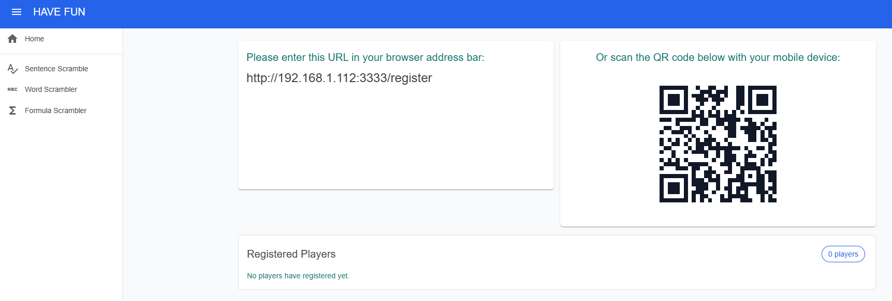
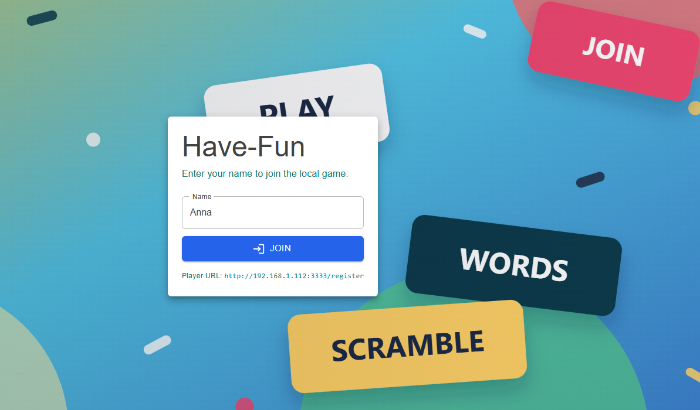
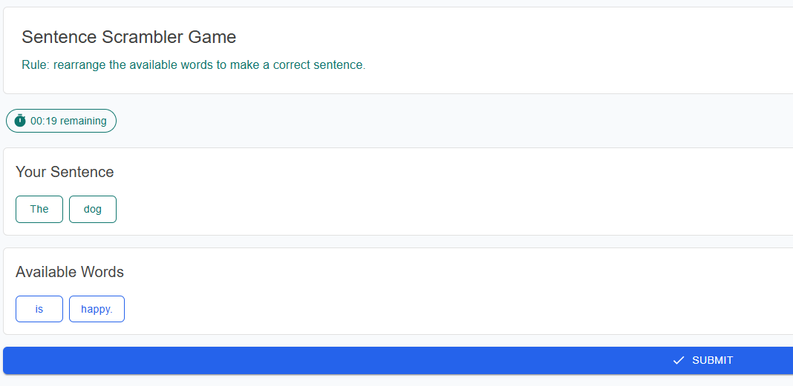
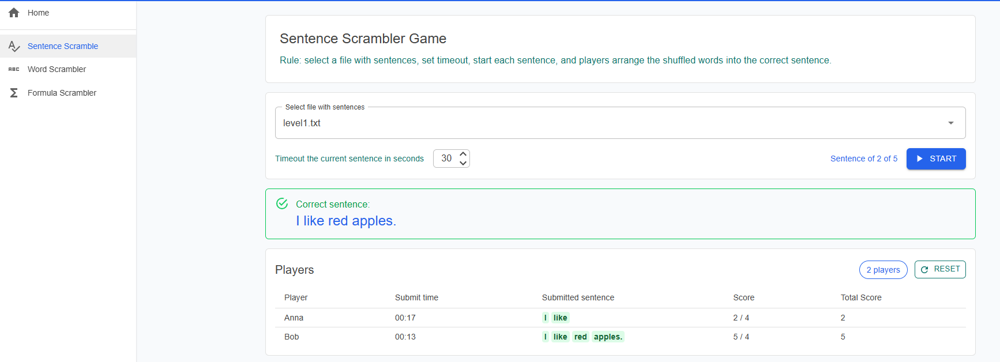

# Have-Fun

Have-Fun is a local LAN party-game web app for friends playing from browsers on the same network.

## Main Features

- Host-controlled Sentence Scrambler rounds.
- Players join from phones, tablets, or computers using a local URL or QR code.
- Timed sentence rounds with shuffled words and click-to-build answers.
- Live host dashboard with player submissions, scores, and total scores.
- In-memory game state with no accounts, database, cloud hosting, or public internet requirement.

## Download And Run A Release

1. Open the GitHub releases page:

   ```text
   https://github.com/sbuyevich/have-fun/releases
   ```

2. Download the latest `dist-win.zip` for Windows or `dist-macos.zip` for macOS from the release assets.
3. Extract the zip file.
4. Open the extracted `Have Fun` folder.
5. Read `README.md` in the extracted folder for instructions on running and using the app.

## Implementation

Have-Fun is a Blazor Web App using server-side interactive rendering.
Pages are rendered for two local roles:

- Host pages create and control rounds, share the join link, and show live results.
- Player pages handle registration, waiting for a round, playing, and submission state.

The current browser role is kept in session storage, while game state stays in server memory.

## Create Dist Folders

Distribution builds are created by the scripts in `scripts` folder.

To rebuild both Windows and MacOS packaged folders and zip files on Windows:

```bat
scripts\dist.bat
```

This refreshes:

- `dist-win`
- `dist-win.zip` - for running on Windows 
- `dist-macos`
- `dist-macos.zip` - for running on MacOS

Each publish writes the runnable app into the matching `dist-*` folder's `app` directory.
Upload the zip files to the GitHub release.

## Game Rules

1. Host opens app in browser 



2. Player scans QR using device and goes to Join page



3. Host selectes game from menu, select file from dropdown and click on Start buttom. 

4. Player can click on available tiles with word to collect correct word and clicks submit.


5. Host can see results in table and can start next sentence.



Similar rules are for `Word Scrambler` and `Formula Scramler` games.


