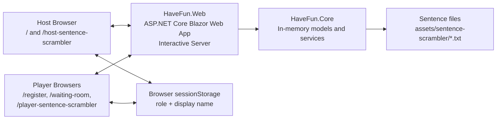
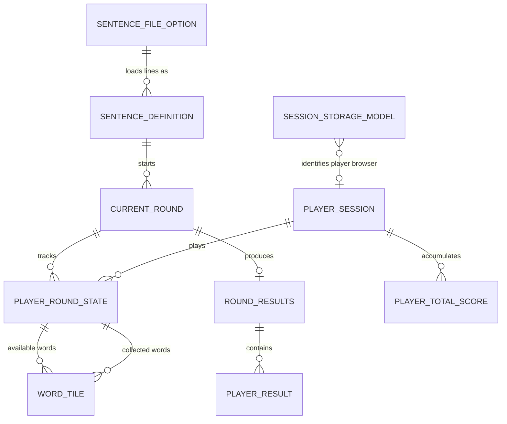
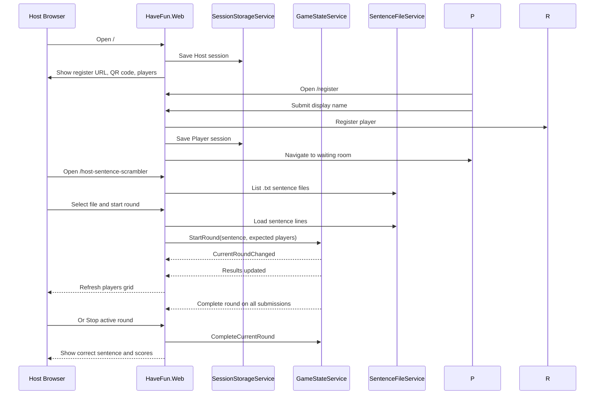
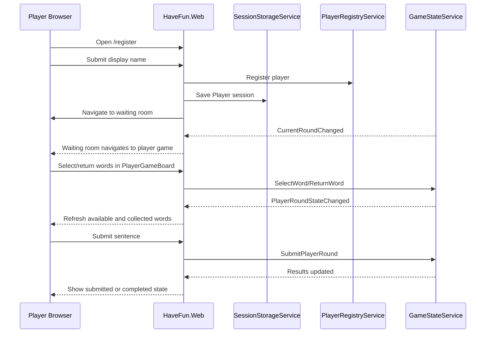

# Have-Fun Architecture

Have-Fun is a local LAN party-game Blazor Web App. The web host serves the UI, keeps game state in memory, and lets the Host and Players interact through browser sessions on the same network.

## System Context

## Entity Relationships

These are in-memory records and service-owned collections, not database tables. Relationships that use player names are logical links, not foreign keys.

## Host Flow

## Player Flow

## State Boundaries

- Server memory stores registered players, active round state, player submissions, results, and total scores.
- Browser `sessionStorage` stores only the current browser's role and display name.
- Sentence content is local file data from `Game:SentenceScramblerPath`.
- Restarting the server clears in-memory players, rounds, submissions, and scores.
- No database, accounts, cloud service, or persistent game history is part of V1.
