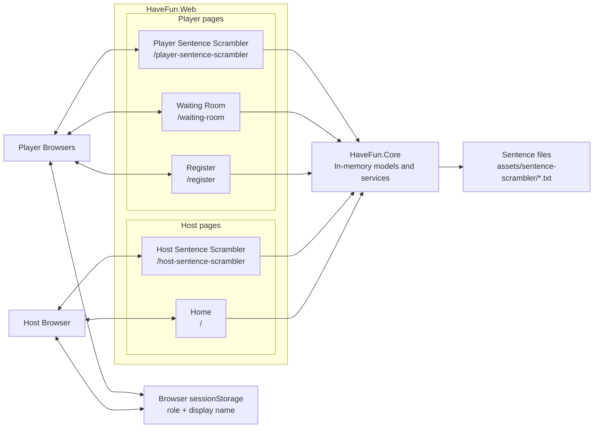
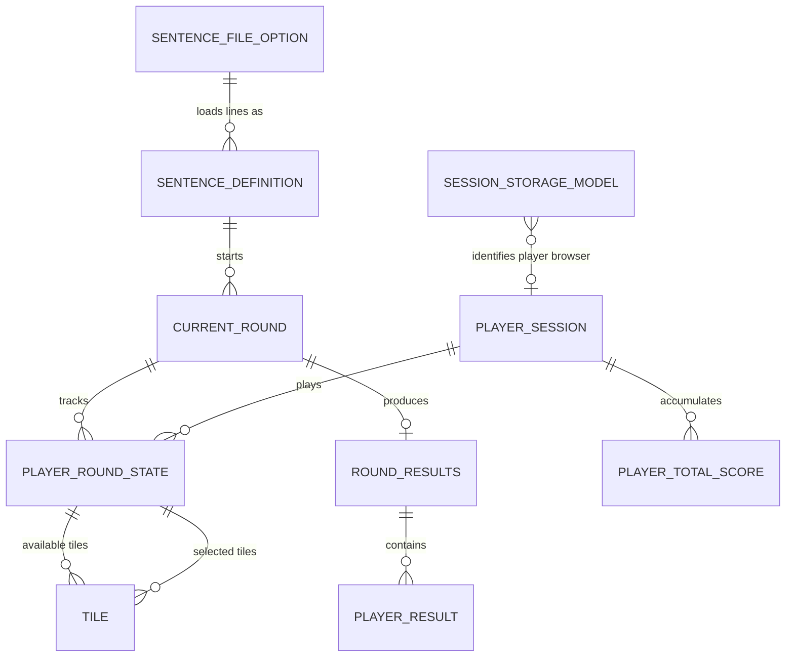
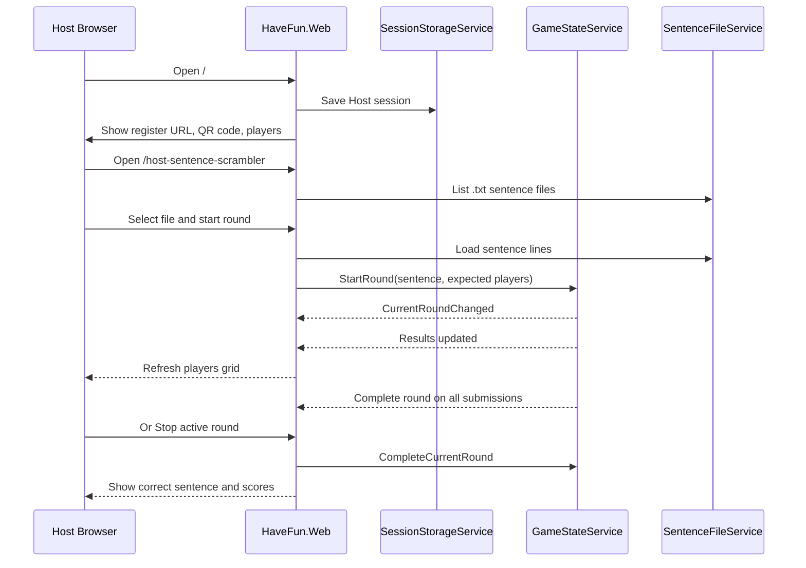
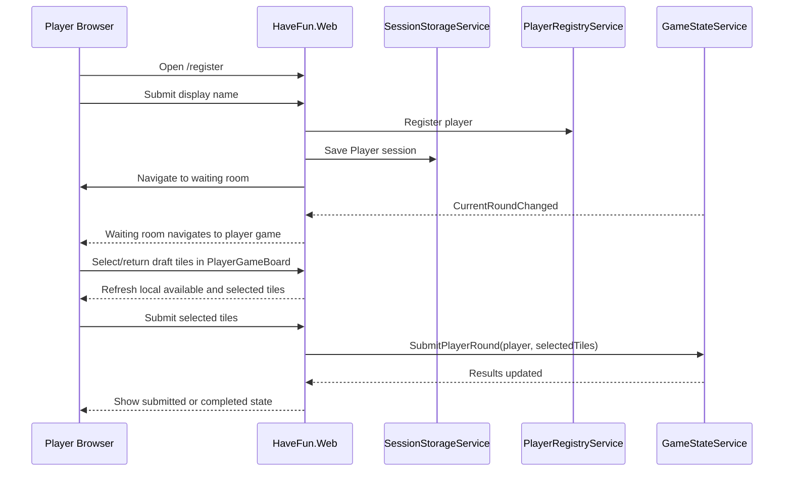
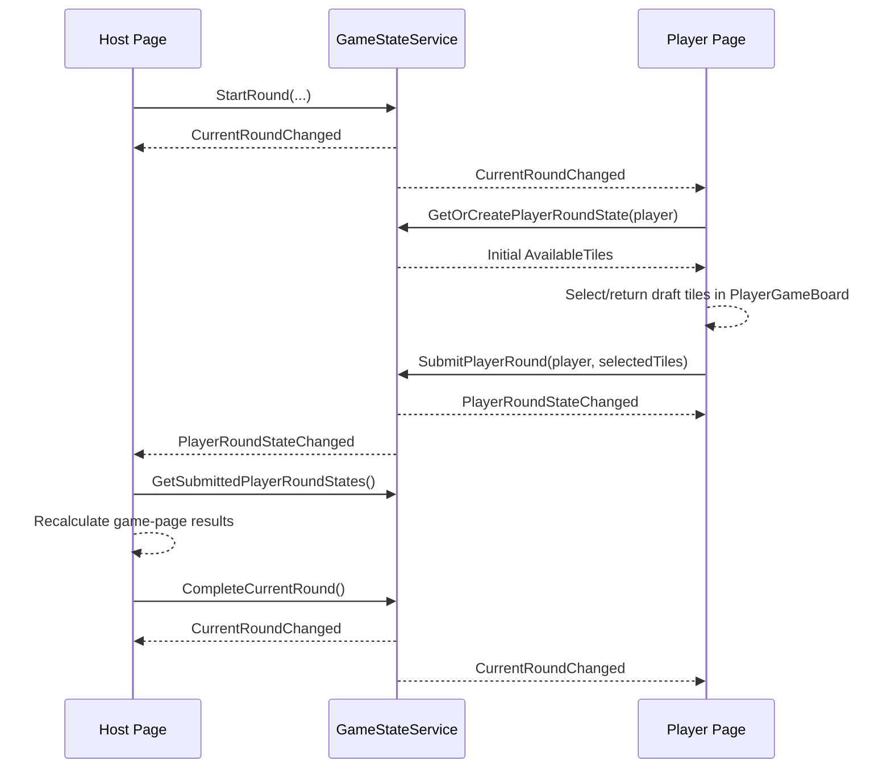

# Have-Fun Architecture

Have-Fun is a local LAN party-game Blazor Web App. The web host serves the UI, keeps game state in memory, and lets the Host and Players interact through browser sessions on the same network.

## System Context

## Entity Relationships

These are in-memory records and service-owned collections, not database tables. Relationships that use player names are logical links, not foreign keys.

## Host Flow

## Player Flow

## Host and Player Page Communication

Host and player pages do not send messages directly to each other. Each browser has its own Blazor Server circuit connected to `HaveFun.Web`, and the pages coordinate through singleton in-memory services in `HaveFun.Core`.

The host page writes round changes into `GameStateService`. Player pages read that same service state and subscribe to service events. Player pages keep draft tile selection inside `PlayerGameBoard`, submit selected tiles to `GameStateService`, and the host page refreshes its result grid when the service raises player-state events.

Communication rules:

- `GameStateService` is the shared source of truth for the active round, submitted player tile state, submissions, and total scores.
- Host pages start/stop rounds and calculate game-specific current-round results for display.
- Player pages select/return draft tiles inside `PlayerGameBoard`; only submitted selected tiles are sent to `GameStateService`.
- `CurrentRoundChanged` tells host/player pages that a round started or completed.
- `PlayerRoundStateChanged` tells host/player pages that a player submitted tiles.
- `SelectedTiles` is the submitted answer; display text is derived from selected tile text when needed.
- Browser `sessionStorage` is only used to remember role and display name; it is not used for host/player messaging.

## State Boundaries

- Server memory stores registered players, active round state, player submissions, results, and total scores.
- Browser `sessionStorage` stores only the current browser's role and display name.
- Sentence content is local file data from `Game:SentenceScramblerPath`.
- Restarting the server clears in-memory players, rounds, submissions, and scores.
- No database, accounts, cloud service, or persistent game history is part of V1.
